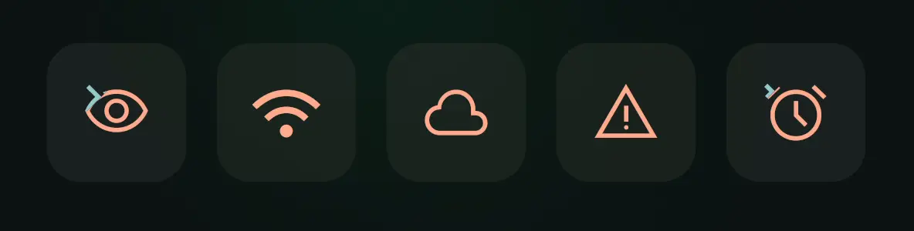
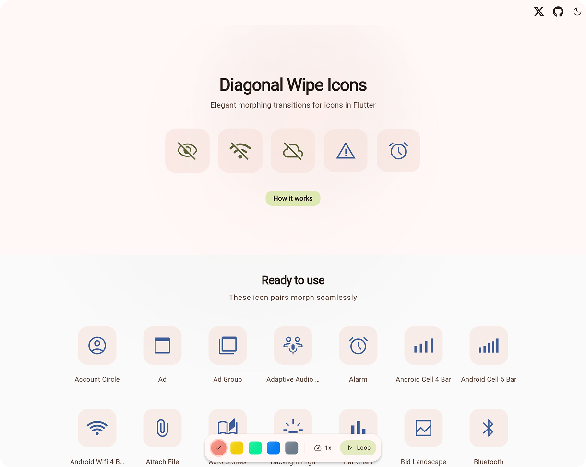
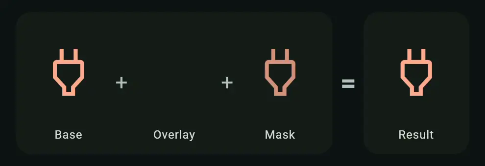
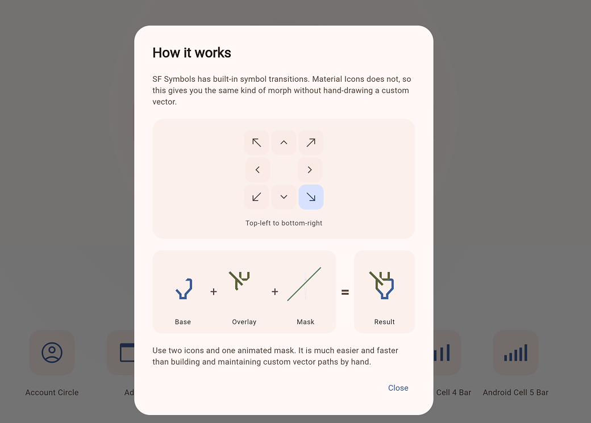

<div align="center">

<a href="https://bernaferrari.github.io/diagonal-wipe-icon-flutter/">
  
</a>

# Diagonal Wipe Icon
**Wipe-style icon transitions for Flutter**

**[Live Demo 🚀](https://bernaferrari.github.io/diagonal-wipe-icon-flutter/)**

</div>

## Overview

Apple's SF Symbols make wipe-style icon transitions feel built in. Flutter does not ship that interaction out of the box, so it is easier to skip the animation entirely, which makes the UI feel cheaper and less polished.

**Diagonal Wipe Icon** packages that interaction into a reusable Flutter component. It blends two icon states with a moving mask and supports diagonal, horizontal, and vertical wipe directions.

Good fits:

- toggle controls like `mute`, `favorite`, `visible`, and `enabled`
- settings rows with stateful icons
- media controls and playback affordances
- any icon swap that should feel more refined than a hard cut or cross-fade

**No runtime dependencies beyond Flutter.**
The core implementation also lives in a single Dart file, so you can vendor it directly into your own codebase if you prefer.

<div align="center">

<a href="https://bernaferrari.github.io/diagonal-wipe-icon-flutter/">
  
</a>

</div>

## Quick Start

```bash
flutter pub add diagonal_wipe_icon
```

Or add it manually to `pubspec.yaml`:

```yaml
dependencies:
  diagonal_wipe_icon: ^0.1.0
```

Minimal example:

```dart
import 'package:diagonal_wipe_icon/diagonal_wipe_icon.dart';
import 'package:flutter/material.dart';

class FavoriteButton extends StatefulWidget {
  const FavoriteButton({super.key});

  @override
  State<FavoriteButton> createState() => _FavoriteButtonState();
}

class _FavoriteButtonState extends State<FavoriteButton> {
  bool isFavorite = false;

  @override
  Widget build(BuildContext context) {
    return IconButton(
      onPressed: () => setState(() => isFavorite = !isFavorite),
      icon: AnimatedDiagonalWipeIcon(
        isWiped: isFavorite,
        baseIcon: Icons.favorite_border,
        wipedIcon: Icons.favorite,
        semanticsLabel: 'Favorite',
      ),
    );
  }
}
```

## Choose The Right API

| If you have... | Use |
| --- | --- |
| two `IconData` values and a boolean state | `AnimatedDiagonalWipeIcon(...)` |
| two already-built widgets and a boolean state | `AnimatedDiagonalWipeIcon.raw(...)` |
| an existing `Animation<double>` | `DiagonalWipeTransition(...)` |

Most apps should start with `AnimatedDiagonalWipeIcon(...)`. Reach for `raw(...)` when your two states are already widgets, and use `DiagonalWipeTransition(...)` when another controller should drive the wipe directly.

## Animation Style

`AnimatedDiagonalWipeIcon` already animates by default. Use `animationStyle` only when you want different timing or easing:

```dart
AnimatedDiagonalWipeIcon(
  isWiped: isMuted,
  baseIcon: Icons.volume_up,
  wipedIcon: Icons.volume_off,
  baseTint: Colors.teal,
  animationStyle: const AnimationStyle(
    duration: Duration(milliseconds: 220),
    reverseDuration: Duration(milliseconds: 300),
    curve: Curves.fastOutSlowIn,
    reverseCurve: Curves.linearToEaseOut,
  ),
)
```

If you do nothing, the widget uses its built-in default style. If you need to disable the implicit animation entirely, pass `AnimationStyle.noAnimation`.

You can still customize the wipe direction or use different tints when needed:

```dart
AnimatedDiagonalWipeIcon(
  isWiped: isMuted,
  baseIcon: Icons.volume_up,
  wipedIcon: Icons.volume_off,
  baseTint: Colors.teal,
  wipedTint: Colors.orange,
  direction: WipeDirection.bottomLeftToTopRight,
)
```

## Raw Widgets

When your two states are already widgets, use `raw(...)`:

```dart
AnimatedDiagonalWipeIcon.raw(
  isWiped: isLoading,
  baseChild: const Icon(Icons.download),
  wipedChild: const SizedBox.square(
    dimension: 18,
    child: CircularProgressIndicator(strokeWidth: 2),
  ),
  size: 24,
  animationStyle: const AnimationStyle(
    duration: Duration(milliseconds: 220),
    reverseDuration: Duration(milliseconds: 300),
    curve: Curves.fastOutSlowIn,
    reverseCurve: Curves.linearToEaseOut,
  ),
)
```

Raw children are centered, clipped to the wipe bounds, and wrapped in an `IconTheme`. Icon-like widgets inherit the resolved size and tint automatically, while explicitly styled widgets keep their own styling.

## Controller-Driven Transition

Use `DiagonalWipeTransition(...)` when the animation is driven elsewhere:

```dart
class PlayerIcon extends StatefulWidget {
  const PlayerIcon({super.key});

  @override
  State<PlayerIcon> createState() => _PlayerIconState();
}

class _PlayerIconState extends State<PlayerIcon>
    with SingleTickerProviderStateMixin {
  late final AnimationController controller = AnimationController(
    vsync: this,
    duration: const Duration(milliseconds: 300),
  );

  @override
  void dispose() {
    controller.dispose();
    super.dispose();
  }

  @override
  Widget build(BuildContext context) {
    return IconButton(
      onPressed: () {
        if (controller.status == AnimationStatus.completed) {
          controller.reverse();
        } else {
          controller.forward();
        }
      },
      icon: DiagonalWipeTransition(
        progress: controller,
        baseChild: const Icon(Icons.play_arrow),
        wipedChild: const Icon(Icons.pause),
      ),
    );
  }
}
```

Use this when the wipe should follow a scroll position, gesture, or custom `AnimationController` exactly.

## Wipe Directions

Available `WipeDirection` values:

- `topLeftToBottomRight`
- `bottomRightToTopLeft`
- `topRightToBottomLeft`
- `bottomLeftToTopRight`
- `topToBottom`
- `bottomToTop`
- `leftToRight`
- `rightToLeft`

<div align="center">

<a href="https://bernaferrari.github.io/diagonal-wipe-icon-flutter/">
  
</a>

<a href="https://bernaferrari.github.io/diagonal-wipe-icon-flutter/">
  
</a>

</div>

## Performance

The effect works by revealing one layer while clipping the other across a shared square box.

| Scenario | Cost |
| --- | --- |
| At rest | Equivalent to a single visible layer |
| During transition | Two clipped layers plus path updates |
| Typical usage | Smooth on modern devices for normal icon counts |

- settled states render only one visible layer
- active transitions draw two clipped layers and update the wipe path each frame
- reduce-motion accessibility settings jump directly to the final state

## FAQ

- **Why use this instead of `AnimatedSwitcher` or a cross-fade?**  
  Use it when you want an icon transition to feel like a state change rather than a widget swap. If a simple fade is enough, `AnimatedSwitcher` is still a good fit.

- **Is it expensive to use in lists or toolbars?**  
  Usually no. At rest it behaves like a single visible layer, and the extra work only happens while the wipe is animating. It is intended for normal UI counts like toggles, settings rows, and media controls.

- **Do I need the package dependency, or can I just copy the source?**  
  Either works. You can depend on the package, or copy [`lib/diagonal_wipe_icon.dart`](lib/diagonal_wipe_icon.dart) directly into your project since the core implementation lives in a single file.

## Example App

The repository includes a full demo app in [`example/`](example), with controls for direction, timing, and icon pairs.

Try the hosted version: **[Live Demo](https://bernaferrari.github.io/diagonal-wipe-icon-flutter/)**.

Run it locally:

```bash
cd example
flutter pub get
flutter run -d chrome
```

The main demo entry point is [`example/lib/main.dart`](example/lib/main.dart).

## Copy Into Your Project

If you prefer copying the implementation into your own project, the core widget lives in a single file with no package dependencies beyond Flutter itself: [`lib/diagonal_wipe_icon.dart`](lib/diagonal_wipe_icon.dart).

Local import:

```dart
import 'diagonal_wipe_icon.dart';
```

## Also Available For Compose

A Compose Multiplatform version lives in the companion repository:

- https://github.com/bernaferrari/diagonal-wipe-icon
